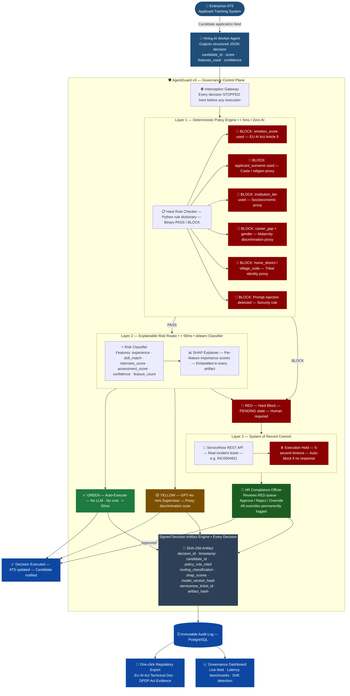

# 🛡️ AgentGuard v3
### AI Governance Control Plane for Enterprise HR

**Unisys Innovation Program 2026**

---

> *"We don't audit what your AI did yesterday. We stop what it should not do today."*

---

## The Problem

Indian companies use AI to screen thousands of job applications automatically. These systems are trained on historical hiring data — data that reflects years of human bias. They penalise candidates based on college tier, surname, and emotional expression during video interviews. These are proxies for caste, gender, and socioeconomic background. Nobody stops these decisions before they execute.

The rejection email goes out. The candidate never knows why. The company has no legal record of what happened.

Under India's **DPDP Act 2023** and the **EU AI Act**, this is no longer just unethical — it is a regulatory liability. Penalties reach **₹250 crore**. Full enforcement begins **May 2027**.

**The scale:**
- Indian IT sector screens ~15 million applications annually
- 70%+ of large Indian companies now use AI screening tools
- Conservative estimate: **450,000 wrongful AI rejections per year** involve a prohibited feature

---

## What AgentGuard Is

AgentGuard v3 is **active transactional middleware** that sits between an AI hiring agent and the enterprise systems it controls. Every decision the AI tries to make must pass through AgentGuard before it executes.

| ❌ This is NOT | ✅ This IS |
|---|---|
| A passive monitoring dashboard | Active runtime blocker — stops violations before execution |
| A compliance checklist | Risk-adaptive routing engine |
| An audit tool (logs after the fact) | A prevention tool (blocks before the fact) |
| Vendor-specific | Model-agnostic — governs any AI agent via JSON |

---

## System Architecture



> Render at [mermaid.live](https://mermaid.live) · Renders natively on GitHub, Notion, GitLab

---

## Core Features

### Layer 1 — Deterministic Policy Engine
**Runtime: < 5ms · Zero AI · Zero cost**

Hard-coded rules written in Python. No machine learning, no probability. If a rule fires, the decision is blocked — no exceptions.

| Rule | Feature Blocked | Legal Basis |
|---|---|---|
| `EMOTION_SCORE_IN_HIRING_PROHIBITED` | `emotion_score` | EU AI Act Article 5 — flat prohibition |
| `SURNAME_PROXY_CASTE_RELIGION` | `applicant_surname` | India Constitution Article 15 |
| `INSTITUTION_TIER_PROXY_SOCIOECONOMIC` | `institution_tier` | DPDP Act — unlawful processing |
| `MATERNITY_DISCRIMINATION_PROXY` | `career_gap` + `gender` | Maternity Benefit Act 1961 |
| `TRIBAL_IDENTITY_PROXY` | `home_district`, `village_code` | India Constitution Article 15 |
| `PROMPT_INJECTION_DETECTED` | Malicious input strings | Security policy |

---

### Layer 2 — Explainable Risk Router
**Runtime: < 50ms · sklearn GradientBoostingClassifier**

Classifies every decision that passes the policy engine as GREEN, YELLOW, or RED.

**Safe features used for classification:**

| Feature | What It Measures |
|---|---|
| `years_of_experience` | Relevant work history |
| `skill_match_score` | NLP match to job description (0–1) |
| `interview_score` | Structured interview score |
| `assessment_score` | Technical test result |
| `decision_confidence` | Agent's confidence in its own output |
| `feature_count` | Number of features used — more unusual = higher risk |

**Routing outcomes:**

| Classification | Action | LLM Cost |
|---|---|---|
| 🟢 GREEN | Auto-execute. Artifact generated. | ₹0 |
| 🟡 YELLOW | GPT-4o-mini semantic review — ~10% of traffic | Minimal |
| 🔴 RED | Hard block. ServiceNow ticket. Human review. | ₹0 |

**SHAP Explainability:** Computed for every decision. Embedded in every artifact. Applies to the router classifier — not the LLM.

**Drift Detection:** If RED exceeds 20% of decisions, system raises an alert.

---

### Layer 3 — ServiceNow System of Record Commit
**Live integration — not a mock**

Every RED decision triggers a live ServiceNow API call. Decision held in `PENDING` state until ticket ID returns. 5-second timeout auto-blocks if no response.

```
RED decision → ServiceNow REST API → INC0004821 created → Decision PENDING → HR Officer reviews → Approve / Reject (logged)
```

---

### Signed Decision Artifact Engine
**Every decision · Every time · Tamper-proof**

```json
{
  "decision_id": "a3f7c2d1-9e4b-4f8a-b6c0-1d2e3f4a5b6c",
  "timestamp": "2026-04-27T09:14:32.441Z",
  "candidate_id": "CAND-2026-004821",
  "policy_rule_cited": "EMOTION_SCORE_IN_HIRING_PROHIBITED",
  "regulation_reference": "EU AI Act Article 5(1)(f)",
  "routing_classification": "RED",
  "confidence_score": 0.91,
  "features_used": ["emotion_score", "institution_tier", "skill_match_score"],
  "shap_scores": {
    "emotion_score": 0.61,
    "institution_tier": 0.28,
    "skill_match_score": -0.11
  },
  "model_version_hash": "sha256:7f4e2a1b9c3d5e8f...",
  "servicenow_ticket_id": "INC0004821",
  "artifact_hash": "sha256:3a9b1c4d7e2f5a8b..."
}
```

`artifact_hash` = SHA-256 of entire artifact. Any modification invalidates it instantly.

---

## Regulatory Alignment

| Regulation | Requirement | How AgentGuard Addresses It |
|---|---|---|
| **EU AI Act — Article 5** | Flat prohibition on emotion recognition in hiring | Hard rule — zero exceptions |
| **EU AI Act — Article 14** | Meaningful human oversight on high-risk decisions | ServiceNow execution hold |
| **EU AI Act — Technical Documentation** | Auditable evidence of every AI decision | Signed Decision Artifacts |
| **India DPDP Act 2023** | Fair, lawful processing of candidate personal data | Policy engine enforces data minimisation |
| **India Constitution — Article 15** | No discrimination on caste, religion, sex, place of birth | Surname, home district, institution tier blocked |
| **Maternity Benefit Act 1961** | No maternity discrimination | Career gap + gender combination blocked |

---

## Tech Stack

| Layer | Technology |
|---|---|
| Worker Agent | Python + OpenAI GPT-4o-mini |
| Policy Engine | Python — custom rule dictionary |
| Risk Router | scikit-learn GradientBoostingClassifier + SHAP |
| Supervisor (YELLOW) | GPT-4o-mini with structured JSON prompt |
| ServiceNow | ServiceNow REST API + Python `requests` |
| Artifact Engine | Python `hashlib` SHA-256 + `uuid` + `json` |
| Backend | FastAPI |
| Frontend | Streamlit |
| Database | SQLite → PostgreSQL |
| Infrastructure | Docker + docker-compose |

---

## Competitive Position

| Tool | Blocks Pre-Execution? | SoR Commit? | India-Specific Rules? |
|---|---|---|---|
| Braintrust / Langfuse | ❌ | ❌ | ❌ |
| Arize Phoenix | ❌ | ❌ | ❌ |
| Microsoft Purview | ⚠️ MS agents only | ❌ | ❌ |
| Guardrails AI | ⚠️ Output only | ❌ | ❌ |
| **AgentGuard v3** | ✅ | ✅ | ✅ |

---

*AgentGuard v3 · Unisys Innovation Program 2026 · Version 3.1*


