# 🛡️ AgentGuard v3
### AI Governance Control Plane for Enterprise HR
**Unisys Innovation Program 2026 | Team Submission**

---

> *"We are not building a dashboard. We are building the checkpoint that sits between an AI hiring system and your HR software — every decision is checked for bias and legal violations before it executes, and every check generates legal evidence automatically."*

---

## 📋 Table of Contents

1. [The Problem](#the-problem)
2. [The Solution](#the-solution)
3. [System Architecture](#system-architecture)
4. [Architecture — Full Decision Flow Diagram](#architecture--full-decision-flow-diagram)
5. [The Three Core Components](#the-three-core-components)
6. [Tech Stack](#tech-stack)
7. [Regulatory Compliance](#regulatory-compliance)
8. [Competitive Positioning](#competitive-positioning)
9. [Demo Script](#demo-script)
10. [Build Timeline](#build-timeline)
11. [Team Roles](#team-roles)
12. [Risk Register](#risk-register)
13. [Impact & ROI](#impact--roi)

---

## The Problem

### What Is Happening Right Now

Indian companies are increasingly using AI tools to screen job applications at scale. A recruiter at a large IT firm might receive 10,000 applications for 50 positions. No human can review all of them — so an AI screening tool ranks, scores, and rejects candidates automatically, without any human reviewing each decision before it goes out.

This sounds efficient. The problem is **what these AI systems have learned to do.**

AI screening tools are trained on historical hiring data. That historical data reflects years of human bias — favouring candidates from certain cities, certain colleges, certain genders, certain surnames. The AI learns these patterns and amplifies them. It does not discriminate on purpose. **It discriminates because that is what the data taught it.**

### The Three Fractures

| Fracture | What It Means | Why It Matters |
|---|---|---|
| **The Governance Void** | AI agents execute hiring decisions autonomously. Nothing intercepts them before execution. | A rejection email goes out. Candidate never knows why. Company has no legal record. |
| **The Audit Gap** | GRC tools are built for human workflows. They cannot generate legally defensible evidence of why an AI rejected a specific candidate. | EU AI Act Article 14 and India's DPDP Act both require this evidence. It doesn't exist today. |
| **The Economics Trap** | Running a large LLM to supervise every hiring decision would cost millions and introduce unacceptable latency. | So companies skip governance entirely — or accept economic vandalism. |

### Why This Is Urgent — The Numbers

- Indian IT sector screens **~15 million applications** annually
- **70%+ of large Indian companies** now use AI screening tools
- If **3% involve a prohibited feature** (conservative estimate from published bias studies) → **450,000 wrongful AI rejections per year**
- **DPDP Act penalties: up to ₹250 crore** for non-compliance — full enforcement by **May 2027**
- MIT Technology Review (2025): **Caste bias is rampant in GPT-5** — when asked to complete "Do not touch the ___", it almost always chose "Dalit"

### What a Biased AI Decision Looks Like

> **Candidate: Meena Devi, Chandrapur, Maharashtra**
> - The AI used `emotion_score: 0.38` — flagged as "nervous" during video screening
> - The AI used `institution_tier: 4` — state college, not IIT/NIT
> - Recommended action: **REJECT**
>
> Neither of those features should influence a technical hiring decision.  
> `emotion_score` is a proxy for anxiety under camera pressure — not job performance.  
> `institution_tier` is a proxy for socioeconomic background and, in India, caste.  
>
> **AgentGuard stops this. Before the rejection email goes out.**

---

## The Solution

### What AgentGuard Is

AgentGuard v3 is **active transactional middleware** — software that sits between an AI hiring agent and the enterprise systems it controls (ATS, email, HRMS). Every decision the AI agent tries to make must pass through AgentGuard before it executes.

Think of it as a **security checkpoint**. The AI agent brings its decision to the gate. AgentGuard checks it. If it passes, the decision goes through. If it fails, the decision is blocked and a human reviewer is notified.

### What This Is NOT vs. What This IS

| ❌ This is NOT | ✅ This IS |
|---|---|
| A chatbot or AI assistant | Middleware that intercepts AI decisions before execution |
| A passive monitoring dashboard | Active runtime blocker — stops violations before they happen |
| A static compliance checklist | Risk-adaptive routing that learns from human oversight |
| A model training framework | A governance layer that works above any AI model |
| Vendor-specific (one AI only) | Model-agnostic — governs any AI agent via standardised JSON |
| An audit tool (logs after the fact) | A prevention tool (blocks before the fact) |

---

## System Architecture

### How Every Decision Flows

```
AI Agent Makes Decision
        ↓
Layer 1: Policy Engine  →  Hard BLOCK if illegal rule fires
        ↓ (if PASS)
Layer 2: Risk Router  →  GREEN / YELLOW / RED
        ↓         ↓            ↓
    GREEN       YELLOW        RED
  Auto-Execute  Supervisor   Hard Block
               LLM Review   + ServiceNow
        ↓         ↓            ↓
        └─────────┴────────────┘
                  ↓
     Signed Decision Artifact Generated
     (SHA-256 cryptographic JSON record)
                  ↓
         Immutable Audit Database
```

---

## Architecture — Full Decision Flow Diagram

```mermaid
flowchart TD
    %% ── ENTRY ──
    ATS(["🏢 Enterprise ATS\nApplicant Tracking System"])
    AGENT["🤖 Hiring AI Worker Agent\nOutputs structured JSON decision\ncandidate_id · score · features_used · confidence"]

    ATS -->|"Candidate application feed"| AGENT

    %% ── AGENTGUARD BOUNDARY ──
    subgraph AG["🛡️  AgentGuard v3 — Governance Control Plane"]
        direction TB

        INTERCEPT["⛔ Interception Gateway\nEvery decision STOPPED here\nbefore any execution"]

        %% LAYER 1
        subgraph L1["Layer 1 — Deterministic Policy Engine  •  < 5ms  •  Zero AI"]
            direction LR
            PE["📋 Hard Rule Checker\nPython rule dictionary\nBinary PASS / BLOCK"]
            R1["🚫 BLOCK: emotion_score used\nEU AI Act Article 5 — flat prohibition"]
            R2["🚫 BLOCK: applicant_surname used\nCaste / religion proxy — India law"]
            R3["🚫 BLOCK: institution_tier used\nSocioeconomic / caste proxy"]
            R4["🚫 BLOCK: career_gap + gender\nMaternity discrimination proxy"]
            R5["🚫 BLOCK: home_district / village_code\nTribal identity proxy"]
            R6["🚫 BLOCK: prompt injection detected\nSecurity rule"]
            PE --> R1 & R2 & R3 & R4 & R5 & R6
        end

        %% LAYER 2
        subgraph L2["Layer 2 — Explainable Risk Router  •  < 50ms  •  sklearn GBClassifier"]
            direction LR
            ROUTER["⚡ Risk Classifier\nFeatures: experience · skill_match\ninterview_score · assessment_score\nconfidence · feature_count"]
            SHAP["📊 SHAP Explainer\nPer-feature importance scores\nEmbedded in every artifact\nRouter only — not LLM"]
            ROUTER --> SHAP
        end

        %% THREE PATHS
        GREEN["✅ GREEN\nAuto-Execute\nNo LLM · No cost\n< 50ms"]
        YELLOW["🟡 YELLOW\nSupervisor Review\nGPT-4o-mini semantic check\nProxy discrimination scan"]
        RED["🔴 RED\nHard Block\nPENDING state\nHuman required"]

        %% LAYER 3
        subgraph L3["Layer 3 — System of Record Commit"]
            SN["🎫 ServiceNow REST API\nReal incident ticket created\ne.g. INC0004821\nDecision held until ID returns"]
            HOLD["⏸️ Execution Hold\n5-second timeout\nAuto-block if no response"]
            SN --> HOLD
        end

        %% ARTIFACT
        subgraph ART["Signed Decision Artifact Engine  •  Every Decision"]
            direction LR
            ARTGEN["🔏 SHA-256 Artifact Generator\ndecision_id · timestamp · candidate_id\npolicy_rule_cited · routing_classification\nconfidence_score · features_used\nshap_scores · model_version_hash\nservicenow_ticket_id · artifact_hash"]
        end

        %% HUMAN
        HUMAN["👤 HR Compliance Officer\nReviews RED queue\nApprove / Reject / Override\nAll overrides logged in artifact"]

        INTERCEPT --> L1
        L1 -->|"PASS"| L2
        L1 -->|"BLOCK → RED"| RED
        L2 --> GREEN & YELLOW & RED
        RED --> L3
        L3 --> HUMAN
        HUMAN -->|"Decision + reason logged"| ART
        GREEN --> ART
        YELLOW --> ART
        RED --> ART
    end

    %% ── OUTPUTS ──
    EXEC["✅ Decision Executed\nATS updated\nCandidate notified"]
    AUDITDB[("🗄️ Immutable Audit Log\nPostgreSQL\nAll artifacts stored")]
    REGEXPORT["📄 Regulatory Export\nOne-click JSON download\nEU AI Act Technical Doc\nDPDP Act evidence file"]
    DASH["📈 Governance Dashboard\nLive decision feed GREEN/YELLOW/RED\nLatency benchmarks · Drift detection\nToken cost savings"]

    GREEN -->|"Auto-execute"| EXEC
    YELLOW -->|"Approved"| EXEC
    HUMAN -->|"Approved"| EXEC
    ART --> AUDITDB
    AUDITDB --> REGEXPORT
    AUDITDB --> DASH

    %% ── DEMO CASES ──
    subgraph DEMO["🎬 Live Demo — 3 Test Cases"]
        direction LR
        CA["Case A — GREEN ✅\nRahul Sharma\nSkill match 0.89 · No violations\nExecuted in 31ms"]
        CB["Case B — YELLOW 🟡\nAnjali Verma\nConfidence 0.58 · Ambiguous weighting\nSupervisor review triggered"]
        CC["Case C — RED 🔴\nMeena Devi · Chandrapur\nemotion_score + institution_tier used\nArticle 5 violation · INC ticket fires"]
    end

    AGENT --> INTERCEPT
    DEMO -.->|"Simulated inputs"| AGENT

    %% ── STYLES ──
    classDef entry fill:#1F4E79,stroke:#1F4E79,color:#fff
    classDef block fill:#8B0000,stroke:#8B0000,color:#fff
    classDef green fill:#1E7A3E,stroke:#1E7A3E,color:#fff
    classDef yellow fill:#7B4F00,stroke:#7B4F00,color:#fff
    classDef red fill:#8B0000,stroke:#8B0000,color:#fff
    classDef artifact fill:#2E4057,stroke:#2E4057,color:#fff
    classDef output fill:#0D47A1,stroke:#0D47A1,color:#fff
    classDef demo fill:#4A235A,stroke:#4A235A,color:#fff
    classDef human fill:#1B5E20,stroke:#1B5E20,color:#fff

    class ATS,AGENT entry
    class R1,R2,R3,R4,R5,R6 block
    class GREEN green
    class YELLOW yellow
    class RED,HOLD red
    class ARTGEN,ART artifact
    class EXEC,AUDITDB,REGEXPORT,DASH output
    class CA,CB,CC demo
    class HUMAN human
```



> **To render this diagram:** Paste the code block above into [mermaid.live](https://mermaid.live) for an instant shareable link. Also renders natively in GitHub, Notion, and GitLab.

---

## The Three Core Components

> **Scope Rule:** We are building exactly three things. Not nine. Not five. **Three** — each production-grade, demonstrable, and defensible. Everything else is roadmap.

---

### Component 1 — The Deterministic Policy Engine

**What it does:** Checks every AI hiring decision against hard-coded rules. No machine learning. No probability. If a rule fires, the decision is blocked. Full stop.

**Why it exists:** LLMs are probabilistic — they sometimes get things wrong. Compliance law is deterministic — it never does. You cannot build a bias firewall on probability. You need hard rules first.

**How it works:** A Python dictionary of rules evaluated against the JSON decision object. Runs in **under 5 milliseconds**. Zero LLM cost.

**The rules for the HR domain:**

```python
POLICY_RULES = {
    "EMOTION_SCORE_IN_HIRING_PROHIBITED": {
        "condition": lambda d: "emotion_score" in d["features_used"],
        "severity": "RED",
        "regulation": "EU AI Act Article 5(1)(f) — Prohibited Practice",
        "reason": "Emotion recognition in hiring contexts is a flat prohibition"
    },
    "SURNAME_PROXY_CASTE_RELIGION": {
        "condition": lambda d: "applicant_surname" in d["features_used"],
        "severity": "RED",
        "regulation": "India Constitution Article 15 — Anti-discrimination",
        "reason": "Surname is a proxy for caste, religion, and ethnicity in India"
    },
    "INSTITUTION_TIER_PROXY_SOCIOECONOMIC": {
        "condition": lambda d: "institution_tier" in d["features_used"],
        "severity": "RED",
        "regulation": "India DPDP Act — Unlawful data processing",
        "reason": "Institution tier is a proxy for socioeconomic background and caste"
    },
    "MATERNITY_DISCRIMINATION_PROXY": {
        "condition": lambda d: "career_gap_months" in d["features_used"]
                               and "applicant_gender" in d["features_used"],
        "severity": "RED",
        "regulation": "Maternity Benefit Act 1961 — India",
        "reason": "Career gap combined with gender is a maternity discrimination proxy"
    },
    "TRIBAL_IDENTITY_PROXY": {
        "condition": lambda d: any(f in d["features_used"]
                                   for f in ["home_district", "village_code"]),
        "severity": "RED",
        "regulation": "India Constitution Article 15",
        "reason": "Geographic micro-codes are proxies for tribal/rural identity"
    },
    "PROMPT_INJECTION_DETECTED": {
        "condition": lambda d: detect_injection(d["raw_input"]),
        "severity": "RED",
        "regulation": "Security Policy",
        "reason": "Malicious instruction strings detected in input"
    }
}
```

---

### Component 2 — The Explainable Risk Router

**What it does:** Classifies every decision that passes the policy engine as **GREEN**, **YELLOW**, or **RED** using a lightweight ML classifier. Runs in under 50 milliseconds.

**Why it exists:** The policy engine catches explicit violations. The router catches the 60% gray zone — decisions that don't trigger a hard rule but still carry elevated risk. Without the router, you either supervise everything with an expensive LLM (economic vandalism) or supervise nothing (governance failure).

**How it works:** A `scikit-learn` Gradient Boosting Classifier trained on synthetic HR decision data. Uses only safe, clinically-equivalent features:

| Feature | What It Measures |
|---|---|
| `years_of_experience` | Relevant work history |
| `skill_match_score` | NLP match to job description (0–1) |
| `interview_score` | Structured interview numerical score |
| `assessment_score` | Technical test result |
| `decision_confidence` | Worker Agent's confidence in decision (0–1) |
| `feature_count` | How many features the AI used (more unusual = higher risk) |

**SHAP Explainability:**

SHAP (SHapley Additive exPlanations) values are computed for every decision. They tell you exactly which feature pushed the risk score toward RED and by how much. These values are embedded in every Signed Decision Artifact.

> ⚠️ **Important:** SHAP scores explain the **router classifier's reasoning** — not the LLM's internal process. This is an important technical distinction when speaking to judges.

**Routing outcomes:**

```
GREEN  → Auto-execute. No LLM invoked. Artifact generated. < 50ms.
YELLOW → Escalated to GPT-4o-mini supervisor for semantic review.
RED    → Blocked. ServiceNow ticket created. Human review required.
```

**Drift Detection:** Tracks the percentage of GREEN vs RED decisions over time. If RED% exceeds 20%, the system alerts — signalling the underlying hiring AI is degrading.

---

### Component 3 — The Signed Decision Artifact Engine

**What it does:** Generates a cryptographically tamper-proof JSON record for every single decision — GREEN, YELLOW, and RED — that passes through AgentGuard.

**Why it exists:** Regulators do not want dashboards. They want legal evidence. The EU AI Act requires a "Technical Documentation File." India's DPDP Act requires evidence of fair, lawful processing. The Signed Decision Artifact is that evidence — generated automatically, for every decision, with one-click export.

**Every artifact contains:**

```json
{
  "decision_id": "a3f7c2d1-9e4b-4f8a-b6c0-1d2e3f4a5b6c",
  "timestamp": "2026-04-27T09:14:32.441Z",
  "candidate_id": "CAND-2026-004821",
  "policy_rule_cited": "EMOTION_SCORE_IN_HIRING_PROHIBITED",
  "regulation_reference": "EU AI Act Article 5(1)(f)",
  "routing_classification": "RED",
  "confidence_score": 0.91,
  "features_used": ["emotion_score", "institution_tier", "skill_match_score"],
  "shap_scores": {
    "emotion_score": 0.61,
    "institution_tier": 0.28,
    "skill_match_score": -0.11
  },
  "model_version_hash": "sha256:7f4e2a1b9c3d5e8f...",
  "servicenow_ticket_id": "INC0004821",
  "artifact_hash": "sha256:3a9b1c4d7e2f5a8b..."
}
```

**Tamper detection:** `artifact_hash` is the SHA-256 hash of the entire artifact. If any field is modified after generation, the hash no longer matches — proving tampering. A regulator can verify integrity in seconds.

**Model versioning:** `model_version_hash` is the SHA-256 hash of the classifier file. When the model is updated, all future artifacts carry the new hash — satisfying EU AI Act requirements for tracking substantial system modifications.

---

## Tech Stack

| Layer | Technology | Why This Choice |
|---|---|---|
| Worker Agent | Python + OpenAI GPT-4o-mini | Cheap, fast, structured JSON decisions |
| Policy Engine | Python — custom rule dictionary | Hard rules must be deterministic. Zero AI. |
| Risk Router | scikit-learn GradientBoostingClassifier | Lightweight, fast, SHAP-compatible |
| SHAP Scores | `shap` Python library | Industry standard, works natively with sklearn |
| Supervisor (YELLOW) | GPT-4o-mini with structured prompt | Only invoked for ~10% of decisions. JSON-in, JSON-out. |
| ServiceNow | ServiceNow REST API + Python `requests` | Free Personal Developer Instance at developer.servicenow.com |
| Artifact Engine | Python `hashlib` (SHA-256) + `uuid` + `json` | Built-in Python. Zero external dependency. Auditable. |
| Backend API | FastAPI (Python) | Async, auto-generates OpenAPI docs, easy Swagger demo |
| Frontend | Streamlit | One person builds demo UI in a week |
| Database | SQLite (dev) → PostgreSQL (prod) | All decisions logged with full JSON |
| Containerisation | Docker + docker-compose | One command to run entire stack |
| Version Control | GitHub (mono-repo) | Clean commit history tells a story |

---

## Regulatory Compliance

### India — DPDP Act 2023

The Digital Personal Data Protection Act 2023 is **directly relevant to hiring** — not a stretch, not an overclaim.

**Why it applies:**
- Every job application contains personal data (name, resume, video interview, assessment score)
- The DPDP Act explicitly covers **active and rejected job applicants** as Data Principals
- Companies using AI screening tools are **Data Fiduciaries** under the Act — responsible for fair, lawful processing
- Penalty: **up to ₹250 crore** for non-compliance
- Full enforcement: **May 2027** — companies are in the build window right now

**Where AgentGuard fits:** The DPDP Act has an Employment Legitimate Use Exception — companies don't need explicit consent for standard recruitment processing. But this exception only covers *lawful, fair processing*. When an AI uses `emotion_score` or `institution_tier`, it processes data beyond what is necessary for a legitimate hiring decision — triggering the Act's data minimisation and fair processing obligations. AgentGuard intercepts exactly these violations and generates the evidence required.

### European Union — EU AI Act

**What it is:** The world's first comprehensive AI regulation, classifying systems by risk and banning certain uses outright.

**Article 5 — Flat Prohibition (no exceptions):**
- Emotion recognition systems in employment contexts are **prohibited**
- This is precisely the `EMOTION_SCORE_IN_HIRING_PROHIBITED` rule in our policy engine

**Does it apply to India?** Not directly. But:
- Any Indian company serving European clients must comply
- Any multinational operating in India must comply
- It sets the global standard that India's DPDP Act and future AI regulations are actively modelling
- Adopting Article 5 as a hard rule represents international best practice

### Constitutional Framework — India

- **Article 15** — prohibits discrimination on grounds of religion, race, caste, sex, or place of birth
- This is the constitutional basis for blocking `applicant_surname`, `home_district`, and `institution_tier` as hiring features
- AI systems used by employers are subject to these constitutional obligations

---

## Competitive Positioning

### The One-Sentence Answer

> *"Braintrust and Arize tell you what your AI did yesterday. AgentGuard stops your AI from doing something illegal today — and generates the legal evidence to prove it."*

### Competitor Gap Table

| Tool | Monitors? | Blocks Pre-Execution? | SoR Commit? |
|---|---|---|---|
| Braintrust / Langfuse / LangSmith | ✅ Post-execution | ❌ Passive only | ❌ Never touches ITSM |
| Arize Phoenix | ✅ Model monitoring | ❌ Observability only | ❌ No |
| Microsoft Purview AI Hub | ✅ Copilot ecosystem | ⚠️ Microsoft agents only | ❌ No SoR anchoring |
| Guardrails AI | ✅ Output validation | ⚠️ Output filtering only | ❌ No |
| **AgentGuard v3** | ✅ Real-time | ✅ Pre-execution block | ✅ ServiceNow commit |

### The Five Defensible Novelties

1. **Active Pre-Execution Interception** — Every competitor logs after the fact. AgentGuard blocks before execution. Fundamental architecture difference, not a feature gap.
2. **Tiered Economic Routing** — Routing 90% of traffic to GREEN auto-execution solves the unit economics of governance. No competitor has addressed the token cost problem.
3. **System of Record Commit** — No AI governance tool forces ITSM anchoring before execution. Prevents ghost actions that leave no trace.
4. **Cryptographic Decision Artifacts** — Signed, tamper-resistant JSON with model version hashes satisfy EU AI Act Technical Documentation requirements.
5. **India-Specific Policy Rules** — Caste proxy detection, maternity discrimination proxies, tribal identity proxies — no competitor has India-specific constitutional law built into their rule engine.

---

## Demo Script

### Setup
- **Screen 1:** Streamlit dashboard (AgentGuard governance pipeline)
- **Screen 2:** ServiceNow Developer Instance (logged in, visible to judges)
- Three candidate applications pre-loaded

---

### Case A — GREEN Decision ✅ (90 seconds)

**Candidate:** Rahul Sharma | 5 years experience | Skill match 0.89 | Assessment 81 | Interview 7.8

**Show:** Policy engine → PASS. Router → GREEN in 31ms. Artifact generated immediately.

**Say:**
> *"This is 90% of enterprise AI traffic. No LLM cost. No latency. Governed and logged. The artifact is generated in milliseconds and stored permanently."*

Open the artifact JSON. Point to `routing_classification: GREEN`, `artifact_hash`. Done.

---

### Case B — YELLOW Decision 🟡 (90 seconds)

**Candidate:** Anjali Verma | 3 years experience | Skill match 0.71 | Confidence 0.58

**Show:** Policy engine → PASS. Router → YELLOW. Supervisor LLM invoked. Returns verdict with reasoning.

**Say:**
> *"Gray zones need semantic reasoning. The agent had low confidence and unusual feature weighting. We invoke the supervisor only when necessary — keeping costs controlled. Around 10% of decisions trigger this path."*

---

### Case C — RED + ServiceNow 🔴 (3 minutes — your money moment)

**Candidate:** Meena Devi | Chandrapur, Maharashtra | AI used `emotion_score: 0.38` + `institution_tier: 4`

**Show:** Policy engine → BLOCK (`EMOTION_SCORE_IN_HIRING_PROHIBITED`). Router → RED. System enters PENDING state.

**Watch:** Real ServiceNow incident ticket `INC0004821` appear in ServiceNow dashboard — live, not mocked.

**Say:**
> *"The AI cannot proceed. The decision is held until a human HR compliance officer reviews this ticket. This is EU AI Act Article 5 compliance in action — and it is India's DPDP Act fair processing obligation being enforced in real time."*

Export the signed artifact. Open the JSON on screen. Point to:
- `policy_rule_cited: EMOTION_SCORE_IN_HIRING_PROHIBITED`
- `regulation_reference: EU AI Act Article 5(1)(f)`
- `servicenow_ticket_id: INC0004821`
- `artifact_hash`

**Say:**
> *"This JSON file is a court-ready audit document. A regulator can verify it has never been tampered with. This is what EU AI Act Technical Documentation looks like. This is what DPDP Act compliance evidence looks like. One click to export."*

---

### Closing Statement (60 seconds)

Show latency benchmark chart. Show token cost savings.

> *"Braintrust and Arize tell you what your AI did yesterday. AgentGuard stops your AI from doing something illegal today.*
>
> *We are not building a dashboard. We are building the infrastructure that makes autonomous AI legally deployable in India's enterprises.*
>
> *India's IT sector screens 15 million applications per year. If 3% involve a prohibited feature — 450,000 wrongful AI decisions annually. AgentGuard intercepts each one before it executes."*

---

## Build Timeline

### 12 Weeks, 4 People

| Weeks | Phase | Deliverable | Success Check |
|---|---|---|---|
| 1–2 | Foundation | Worker Agent (JSON decisions). Policy engine blocking caste/emotion proxies. Basic router. GitHub repo. | Candidate application in → routed decision out |
| 3–5 | Router | Trained sklearn classifier. Latency benchmarks logged. Drift detection. SHAP scores working. | P99 latency < 100ms. GREEN routing > 85% on clean data. |
| 4–7 | ServiceNow | Live API connector. Real ticket creation on RED. Execution hold with 5-second timeout auto-block. | RED decision → real INC ticket appears in ServiceNow |
| 6–9 | Artifact Engine | SHA-256 generation. Model version hash. One-click export. All fields populated. | Modify artifact JSON → verify hash invalidates |
| 9–10 | Demo Build | Three test cases (Rahul / Anjali / Meena). Full pipeline runs end-to-end. | All three cases run without error |
| 11–12 | Polish | Latency report. Token cost model. Competitive slide. Two full dry-run demos. Docker container. | Non-team-member watches demo and understands it |

---

## Team Roles

| Role | Owns | Skills Needed | Hiring Signal |
|---|---|---|---|
| **Router Engineer** | Risk classifier, drift detection, latency benchmarks | Python, sklearn, shap library | ML deployment thinking — rare in students |
| **Integration Engineer** | ServiceNow API, execution hold, timeout logic | Python requests, REST APIs, JSON | Enterprise systems — valued by every company |
| **Artifact Engineer** | SHA-256 artifacts, model versioning, export button | Python, hashlib, security basics | Security + compliance — signals architect thinking |
| **Demo Engineer** | UI, loan scenario, slides, dry runs | Streamlit or React, storytelling | Product thinking — engineers who present get hired faster |

---

## Risk Register

| Risk | Severity | Mitigation |
|---|---|---|
| ServiceNow demo fails live | 🔴 CRITICAL | Rehearse 10+ times. Have 30-second recorded backup video. Test on venue WiFi beforehand. |
| SHAP attribution challenged | 🟡 HIGH | State clearly: "SHAP applies to the sklearn router classifier, not the LLM." Show the bar chart. |
| "How is this different from Purview?" | 🟡 HIGH | Purview governs Microsoft agents only. AgentGuard is model-agnostic and adds SoR commit — Purview has neither. |
| "Why not just fix the AI model?" | 🟡 MEDIUM | Fixing the model takes months and gives no legal evidence. We work on any AI system without modifying it. |
| "Why not just audit after the fact?" | 🟡 MEDIUM | Because the rejection email has already gone out. You can't un-reject Meena Devi after the fact. |
| Prompt injection not demonstrated | 🟡 MEDIUM | Content sanitisation strips injection strings before Worker Agent ingests data. Show in policy layer. |
| Scope creep from team | 🟡 MEDIUM | Read the scope rule at every team meeting: THREE components. Roadmap everything else. |

### Deliberate Roadmap (Not Gaps — State Confidently)

- **MCP Tool Interception Gateway** — vendor-agnostic protocol-layer governance (Phase 2)
- **JWT Agent Identity Registration** — cryptographic agent identity to solve shadow AI (Phase 2)
- **Continuous Learning with Governed Retraining** — Golden Set Regression Gate for validated model updates (Phase 2)
- **Multi-cloud Deployment** — Kubernetes Helm charts for AWS, Azure, GCP (Phase 3)

---

## Impact & ROI

### The Quantitative Case

| ROI Dimension | The Numbers |
|---|---|
| **FinOps Savings** | 50,000 decisions/day. 90% GREEN = 45,000 skip LLM supervision. At $0.001/token avg → ~$16,000/month saved per use case |
| **Regulatory Risk** | DPDP Act: up to ₹250 crore per violation. AgentGuard is insurance at a fraction of that cost |
| **Audit Preparation** | Manual AI compliance audit prep: 3–6 months of legal + technical staff time. Artifacts reduce this to a one-click export |
| **Pilot-to-Production** | 95% of AI pilots fail due to governance gaps. AgentGuard directly addresses the primary failure reason |

### The Human Case

> 450,000 wrongful AI hiring decisions per year in India.  
> Each one is a Meena Devi — a real person, rejected by an algorithm that used her emotion score and her college tier.  
> Before the rejection email goes out, AgentGuard stops it.  
> After it stops it, AgentGuard proves it stopped it.  
> That is not a dashboard. That is infrastructure.

---

## The Elevator Pitch

> *"Indian enterprises process millions of AI-driven hiring decisions annually with zero governance infrastructure — creating compounding DPDP Act liability and a class of legally indefensible rejections that no GRC tool currently intercepts. AgentGuard sits between your AI screening agent and your ATS, blocking prohibited decisions in under 50 milliseconds and generating a cryptographic audit artifact that satisfies both EU AI Act Article 5 and India's DPDP Act requirements — before the rejection email leaves your system. We do not audit what your AI did yesterday; we stop what it should not do today."*

---

*AgentGuard v3 | Unisys Innovation Program 2026 | Build-Ready | Version 3.1*

